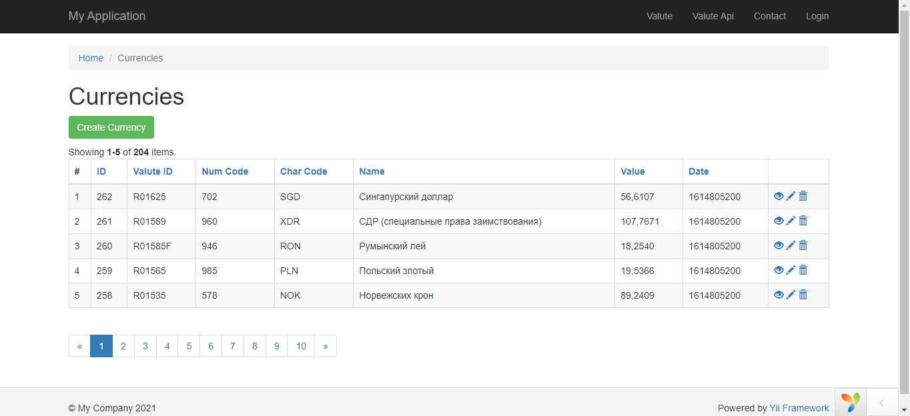
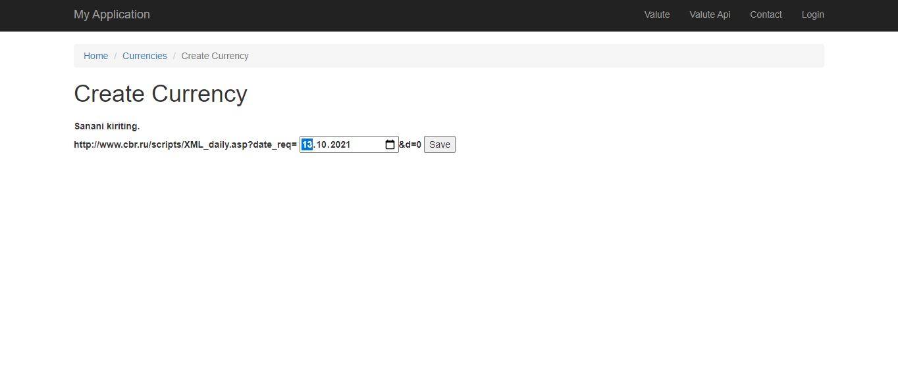
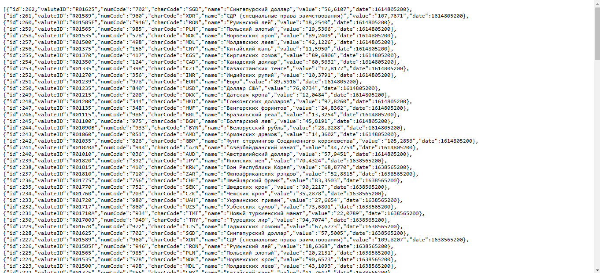

# yii2BasicRestApi
Ushbu yii2 framework moduli, REST API dan foydalanshga qisqacha misol sifatida joylashtirildi.
Ushbu misoldan foydalangan holda "yii2 framework"da REST API so'rovini shakllantirishni o'rganishimiz mumkin. 

Valyuta kurslari haqida ma'lumot olish sahihasi:

Valyuta kursilari haqida ma'lumot olish uchun API so'rov yuborish sahifasi:

Yuborilgan so'rovga javob ma'lumotlarini JSON format qabul qilish:

